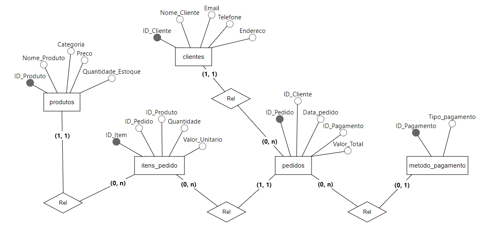
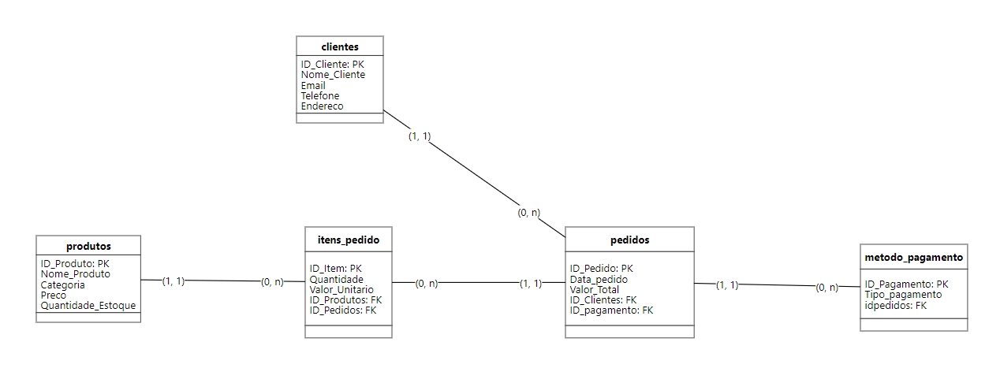
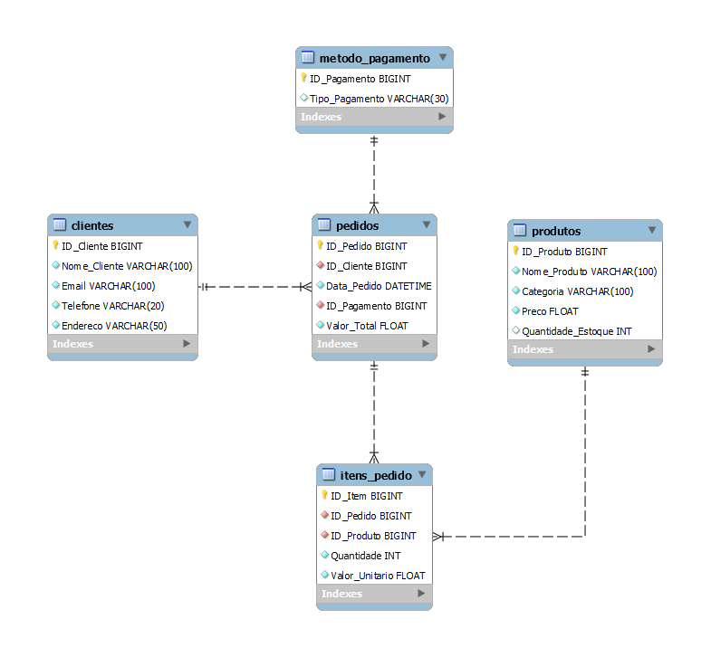

# Data Base

## 🔍 Sobre

> Um banco de dados é uma coleção organizada de informações - ou dados - estruturadas, normalmente armazenadas eletronicamente em um sistema de computador. Um banco de dados é geralmente controlado por um sistema de gerenciamento de banco de dados (DBMS). Juntos, os dados e o DBMS, juntamente com os aplicativos associados a eles, são chamados de sistema de banco de dados, geralmente abreviados para apenas banco de dados.

> Os dados nos tipos mais comuns de bancos de dados em operação atualmente são modelados em linhas e colunas em uma série de tabelas para tornar o processamento e a consulta de dados eficientes. Os dados podem ser facilmente acessados, gerenciados, modificados, atualizados, controlados e organizados. A maioria dos bancos de dados usa a linguagem de consulta estruturada (SQL) para escrever e consultar dados.

| [O que é um Banco de Dados?](https://www.oracle.com/br/database/what-is-database/) - Oracle.com

## 📘 Aula

Nesta aula, relembramos os conceitos e noções básicas de como funciona um banco de dabos, para quê ele serve e alguns exemplos práticos de onde é ultilizado.

Foi nos solicitado ao ultilizar o compilador online [OneCompiler](https://onecompiler.com/postgresql) para treinar as estruturas de [DML e DDL](https://learnsql.com.br/blog/o-que-sao-ddl-dml-dql-e-dcl-em-sql/), ultilizando a [PostgreSQL](https://www.postgresql.org/).

No arquivo [PDF](./1-Atividade_em_Aula/BancodeDados_20241008191337.pdf), foi nos passado 10 exercícios para treinar essas estruturas. Os resultados podem ser consultados nesse [arquivo](https://github.com/Anderson-Andy-Correa/Gestao-e-qualidade-de-software/blob/main/03-Banco_de_Dados/1-Atividade_em_Aula/Atividade_Postgre.txt). 

Foi dado então um [exercício](./2-Exercicio_Apresentacao/InstrucoesDesafioBD_20241008195742.pdf) para fazer em casa e apresentar em aula.

## 📝 Exercício proposto

    

Inicialmente foi pensado nas tabelas e relações que foi proposto e se contruiu o seguinte modelo conceitual prar representar as tabelas:

Estabeleceu-se então as ideias de relações e certificando da estrutura escolhida, detalhamos o modelo para um lógico:

Por fim, emtramos com a mão na massa e formos para o MySQL Workbranch para fazer a estrutura do nosso banco de dados, inserindo um [sript de criação](./2-Exercicio_Apresentacao/Scripts/Criacao_DB.sql). Adimitindo a estrutura final, criamos o modelo físico de como já está criado em nosso banco de dados.

Ao usar o [script para inserir](./2-Exercicio_Apresentacao/Scripts/Insercao_Registros.sql) 50 registros para cada tabela, testamos nosso banco de dados para verificar se a estrutura de CRUD está sendo feita corretamente e salvamos em um [arquivo](./2-Exercicio_Apresentacao/Scripts/Testes_padrão.sql) para um posterior possível teste.

Para testar mais conhecimentos, decidimos tentar usar a ferramenta [Supabase](https://supabase.com/) para deixar a nossa base de dados na nuvem e acessar-la de qualquer lugar. Porem a linguagem ultilizada teve que ser readequada para [PostgreSQL](https://www.postgresql.org/). Mantendo na seguinte estruturação:

    

Como sugestões de melhorias ao banco proposto, temos mais alguns pontos:

* Caso um cliente tenha amis de um endereço, colocamos mais uma tabela referente aos endereços, possibilitando flexibilidade ao sistema em distribuir para mais localidades.
* Caso queira ver um histórico de status do pedido (Saiu para entrega, cancelou, concluiu, etc) colocamos mais 2 tabelas para que seja possível esse rastreio e deixamo o projeto mais bem contruído.
* Adicionamos para cada tabela uma possibilidade de rastreio administrativo para adições ou modificações de registro.
* Outra ideia não colocada em prática seria pensar em um sistema de login e crendenciamento, mas isso fica apra próximas oportunidades.

O modelo sugerido no final foi este:

Scrips - [Criacao](./3-Exercicio_Extra/Scripts/Extra_Criacao_DB.sql) - [Inserção](./3-Exercicio_Extra/Scripts/Extra_Insercao_Registros.sql)

## ✔ Conclusões

Estamos prontos para os desafios dessa aula e esperamos responder a todas as perguntas sem dificuldades!

 *Aguardando aula para considerações finais*
