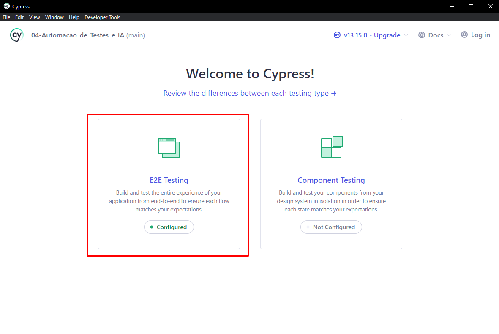
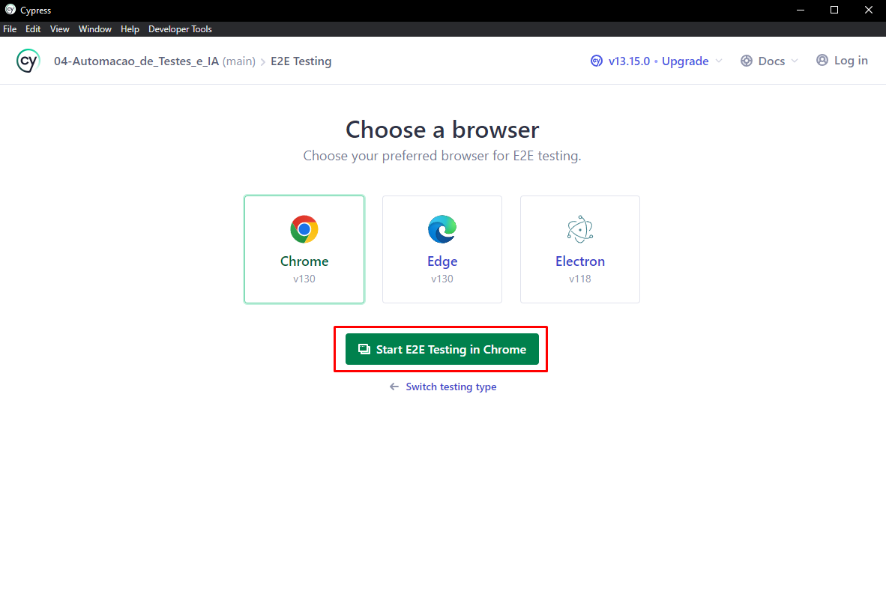
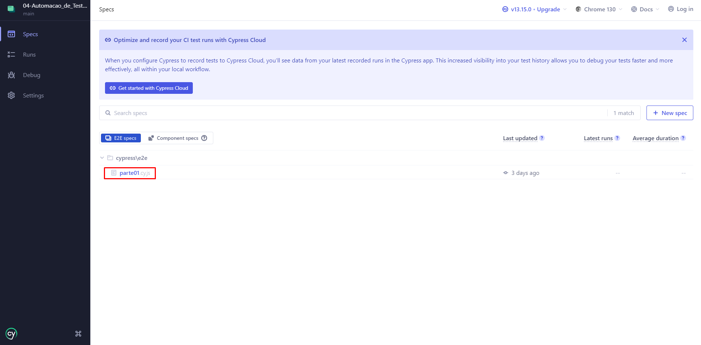
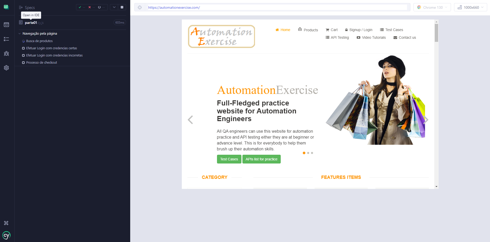

## 🔍 Sobre

> A automação de processos é o uso da tecnologia e da integração de dados e sistemas para automatizar tarefas que antes eram desempenhadas manualmente, de forma a aumentar a produtividade, a eficiência e a geração de valor. 

>Ela pode ser alcançada por meio de robôs ou outros dispositivos mecânicos que executam atividades no lugar dos profissionais, mas nem sempre envolve a substituição do trabalhador humano pela tecnologia ou equipamento. 

| [O que é automação de processos?](https://www.totvs.com/blog/gestao-para-assinatura-de-documentos/automacao-de-processos/) - Totvs.com

> A automação de testes é a prática de revisar e validar automaticamente um produto de software, como um aplicativo da Web, para garantir que ele atenda aos padrões de qualidade predefinidos de estilo de código, funcionalidade (lógica de negócios) e experiência do usuário.

| [O que é automação de testes?](https://www.atlassian.com/br/devops/devops-tools/test-automation) - Atlassian.com

## 📘 Aula

Nesta aula, aprendemos a importancia que automação tem no rotina de cada desenvolvedor. Como a ultilização de ferramentas que auxiliam no processo automatizado de criação, validação e adaptação dos testes, trazem benefícios em questão de tempo, análise de casos e entre outros fatores.

Foi nos dado um [desafio](./blob/main/04-Automacao_de_Testes_e_IA/IAAutomacao_20241022195733.pdf) de navegar pelo site [AutomationExercise](https://automationexercise.com/) e usando ferramente inteligência artificial (nessa caso chatGPT) nos auxiliar na resolução de problemas e criação de testes de caso.

## 📝 Exercício proposto

    

Parte 1: Automação de Testes no Site " https://automationexercise.com/

1. Site para Testes:

    a. Utilize o site de e-commerce para testes: https://automationexercise.com/.

2. Cenários de Teste a Serem Automatizados:

    a. Cenário 1: Acesse a página principal e realize uma busca por um produto qualquer.

    b. Cenário 2: Navegue até a página de login, preencha os campos de login e senha com dados fictícios e tente efetuar o login.
    
    c. Cenário 3: Navegue até uma categoria de produtos (por exemplo, "T- shirts"), adicione um item ao carrinho e simule o início do processo de checkout.

3. Ferramenta de Automação:

    a. Utilize Cypress para automatizar os cenários descritos.

    b. Escreva os testes de forma organizada e modularizada.

    c. Utilize boas práticas para garantir que os testes sejam reutilizáveis e de fácil manutenção.

4. Entrega:

    a. Suba o código em um repositório no GitHub.

    b. Forneça o link do repositório e certifique-se de que o código está bem documentado para que qualquer pessoa possa entender e executar os testes.

    

Para poderes testar as funcionabilidades do desafio, é necessário ter algunas coisas instaladas.

* [Node.js](https://nodejs.org/pt)

Basta acessar o site oficial e baixar a versão mais recente, neste caso, estou usando a v20.18.0.

    

Após isso, use o cmd e execute o comando nessa mesma pasta ([04-Automacao_de_Testes_e_IA](./04-Automacao_de_Testes_e_IA)):

~~~
npm install
~~~

E depois:

~~~
npx cypress open
~~~

Deve abrir a página inicial do Cypress, então selecione a opção E2E Testing,conforme a imagem.

Escolha o navegador de sua preferência e clique no botão marcado.

A prágina principal do projeto deve abrir e já aparecer a Spec parte01.cy.js, clique nele e deve começar a mostrar os testes em execução.

    

* Utilize o site de e-commerce para testes: https://automationexercise.com/.

Para melhor reultilização do código, preferi colocar no arquivo [commands.js](./cypress/support/commands.js)
~~~javascript
Cypress.Commands.add('pesquisarProduto', (nomeProduto) => {
    cy.get('#header > div > div > div > div.col-sm-8 > div > ul > li:nth-child(2) > a').click()
    cy.get('#search_product').type(nomeProduto)
    cy.get('#submit_search').click()
    cy.get('body > section:nth-child(3) > div > div > div.col-sm-9.padding-right > div > div.col-sm-4 > div > div.choose > ul > li > a').click()
})
~~~

## ✔ Conclusões

Estamos prontos para os desafios dessa aula e esperamos responder a todas as perguntas sem dificuldades!

 *Aguardando aula para considerações finais*
