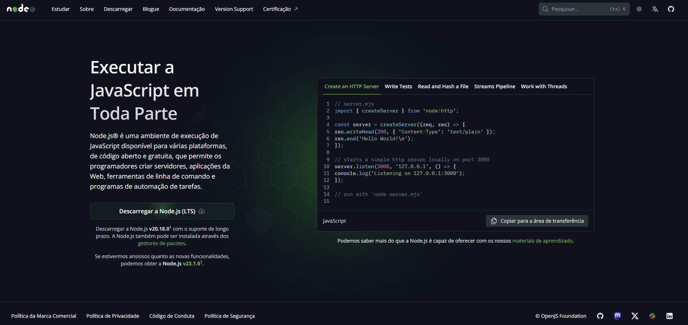
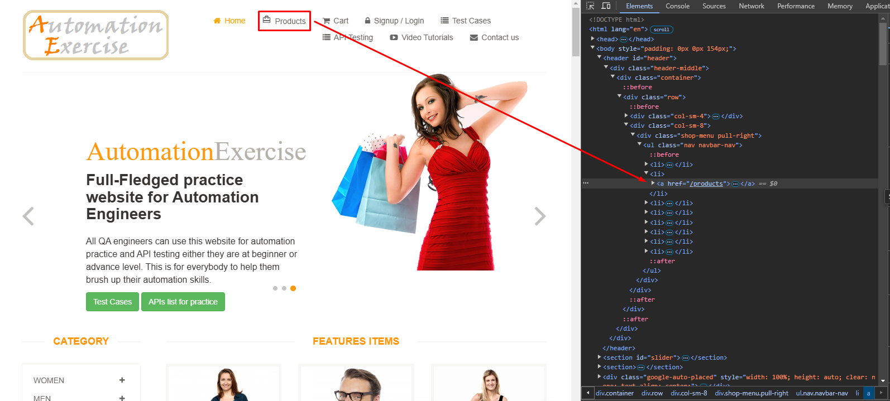

# 

## 🔍 Sobre

> A automação de processos é o uso da tecnologia e da integração de dados e sistemas para automatizar tarefas que antes eram desempenhadas manualmente, de forma a aumentar a produtividade, a eficiência e a geração de valor. 

>Ela pode ser alcançada por meio de robôs ou outros dispositivos mecânicos que executam atividades no lugar dos profissionais, mas nem sempre envolve a substituição do trabalhador humano pela tecnologia ou equipamento. 

| [O que é automação de processos?](https://www.totvs.com/blog/gestao-para-assinatura-de-documentos/automacao-de-processos/) - Totvs.com

> A automação de testes é a prática de revisar e validar automaticamente um produto de software, como um aplicativo da Web, para garantir que ele atenda aos padrões de qualidade predefinidos de estilo de código, funcionalidade (lógica de negócios) e experiência do usuário.

| [O que é automação de testes?](https://www.atlassian.com/br/devops/devops-tools/test-automation) - Atlassian.com

## 📘 Aula

Nesta aula, aprendemos a importancia que automação tem na rotina de cada desenvolvedor. Como a ultilização de ferramentas que auxiliam no processo automatizado de criação, validação e adaptação dos testes, trazem benefícios em questão de tempo, análise de casos e outros fatores.

Foi nos dado um [desafio](./IAAutomacao_20241022195733.pdf) de navegar pelo site [AutomationExercise](https://automationexercise.com/) e usando ferramenta inteligência artificial (nessa caso, chatGPT) nos auxiliar na resolução de problemas e criação de casos de teste.

## 📝 Exercício proposto

  ### 

---

Parte 1: Automação de Testes no Site " https://automationexercise.com/

1. Site para Testes:

    a. Utilize o site de e-commerce para testes: https://automationexercise.com/.

2. Cenários de Teste a Serem Automatizados:

    a. Cenário 1: Acesse a página principal e realize uma busca por um produto qualquer.

    b. Cenário 2: Navegue até a página de login, preencha os campos de login e senha com dados fictícios e tente efetuar o login.
    
    c. Cenário 3: Navegue até uma categoria de produtos (por exemplo, "T- shirts"), adicione um item ao carrinho e simule o início do processo de checkout.

3. Ferramenta de Automação:

    a. Utilize Cypress para automatizar os cenários descritos.

    b. Escreva os testes de forma organizada e modularizada.

    c. Utilize boas práticas para garantir que os testes sejam reutilizáveis e de fácil manutenção.

4. Entrega:

    a. Suba o código em um repositório no GitHub.

    b. Forneça o link do repositório e certifique-se de que o código está bem documentado para que qualquer pessoa possa entender e executar os testes.

Parte 2: Aplicando IA na Automação de Testes

1. Exploração de IA:

    a. Escreva um breve texto (5 a 10 frases) explicando como a IA poderia ser aplicada para melhorar ou otimizar o processo de automação de testes
que você realizou.

    b. Pense em como a IA poderia, por exemplo, identificar comportamentos de usuários que você não previu, sugerir novos casos de teste, ou automatizar a priorização dos testes mais críticos com base no uso real
do site.

2. Entrega:

    a. Envie o texto junto com o código no GitHub ou em um documento
separado.

---

  ### 

---

Para poderes testar as funcionalidades do desafio, é necessário ter alguns itens instalados.

* [Node.js](https://nodejs.org/pt)

Basta acessar o site oficial e baixar a versão mais recente, neste caso, estou usando a versão 20.18.0.

---

  ### 

---

Após isso, use o terminal e execute o comando nessa mesma pasta ([04-Automacao_de_Testes_e_IA](./04-Automacao_de_Testes_e_IA)):

~~~
npm install
~~~

E depois:

~~~
npx cypress open
~~~

Deve abrir a página inicial do Cypress, então selecione a opção E2E Testing,conforme a imagem abaixo.

Escolha o navegador de sua preferência e clique no botão marcado.

A página principal do projeto deve abrir e já aparecer a Spec parte01.cy.js, clique nele e deve começar a mostrar os testes em execução.

---

  ### 

---

> * Utilize o site de e-commerce para testes: https://automationexercise.com/.

> a. Cenário 1: Acesse a página principal e realize uma busca por um produto qualquer.

Para melhor reutilização do código, preferi colocar no arquivo [commands.js](./cypress/support/commands.js), comandos customizados para poder utilizar mais para frente no projeto. Inicialmente para resolver esse primeiro desafio, salvei esse procedimento que pesquisa um determianado produto seguindo a estrutura do site, conforme a imagem de exemplo abaixo.

~~~javascript
Cypress.Commands.add('pesquisarProduto', (nomeProduto) => {
    cy.get('a[href="/products"]').click()
    cy.get('input[id="search_product"]').type(nomeProduto)
    cy.get('button[id="submit_search"]').click()
    cy.get('a[href="/product_details/30"]').click()
})
~~~

Já no arquivo da spec [parte01.cy](\cypress\e2e\parte01.cy.js), onde fica as resoluções finais, defini que para cada teste já visitasse a página inicial da AutomationExercise.com e pedí para executar o comando de pesquisarProduto, usando a expressão "T-shirts".

~~~javascript
describe('Navegação pela página', () => {
  
  beforeEach(() => {
    cy.visit('https://automationexercise.com/')
  })

  it('Busca de produtos', () => {
    cy.pesquisarProduto('T-shirts')
  })

})
~~~

> b. Cenário 2: Navegue até a página de login, preencha os campos de login e senha com dados fictícios e tente efetuar o login.

Criei mais um comando personalizado para entrar com um login e senha para reaproveitar o código.

~~~javascript
Cypress.Commands.add('logarNaConta', (email, senha) => {
    cy.get('a[href="/login"]').click()
    cy.get('input[data-qa="login-email"]').type(email)
    cy.get('input[data-qa="login-password"').type(senha)
    cy.get('button[data-qa="login-button"]').click()
})
~~~

E depois criei dois testes, usando uma conta existente com as credenciais corretas e outro teste com as credenciais incorretas.

~~~javascript
it('Efetuar Login com credencias certas', () => {
  cy.logarNaConta('usercypress@mail.com', 'cypress')
  cy.get('a[href]').should('contain', 'Logout');
})

it('Efetuar Login com credencias incorretas', () => {
  cy.logarNaConta('user@mail.com', 'user')
  cy.url().should('include', '/login');
  cy.get('p').should('contain', 'incorrect');
})
~~~

> c. Cenário 3: Navegue até uma categoria de produtos (por exemplo, "T- shirts"), adicione um item ao carrinho e simule o início do processo de checkout.

Reutilizando tudo o que aprendi nessa aula, segui o processo completo de checkout e criei um outro processo customizado de preencherFormularioPagamento pela complexidade de várias etapas, separando as dependências.

Na spec:

~~~javascript
it('Processo de checkout', () => {
  cy.logarNaConta('usercypress@mail.com', 'cypress')
  cy.pesquisarProduto('T-shirts')
  cy.get('button[class="btn btn-default cart"]').click()
  cy.get('div[id="cartModal"] a[href="/view_cart"]').click()
  cy.get('a[class="btn btn-default check_out"]').click()
  cy.get('textarea[name="message"]').type('Deixa o like Família!')
  cy.get('a[href="/payment"]').click()
  cy.preencherFormularioPagamento('Deixa', 'o', 'like', 'familia', '!')
  cy.get('button[id="submit"]').click()
  cy.url().should('include', '/payment_done')
}) 
~~~

Na lista de comandos:

~~~javascript
Cypress.Commands.add('preencherFormularioPagamento', (nome, numero, cvc, mes, ano) => {
  cy.get('input[data-qa="name-on-card"]').type(nome);
  cy.get('input[data-qa="card-number"]').type(numero);
  cy.get('input[data-qa="cvc"]').type(cvc);
  cy.get('input[data-qa="expiry-month"]').type(mes);
  cy.get('input[data-qa="expiry-year"]').type(ano);
});
~~~

> Parte 2: Aplicando IA na Automação de Testes

>a. Escreva um breve texto (5 a 10 frases) explicando como a IA poderia ser aplicada para melhorar ou otimizar o processo de automação de testes que você realizou.

Como eu não tenho muita prática com essa linguagem e precisava de ajuda para executar esses exercícios, foi fundamental ter auxilio do ChatGPT, me orientando de como conseguir as informações e auxiliando em como melhorar o meu código. 

Sempre que eu terminava um trecho de código para testar, pedia para avaliar como estava ficando a qualidade do código e como fazer para escalonar de uma forma mais prática. Ele não só me ensinou o esquema de pastas e comandos customizados, mas também me ensinou como pegar os elementos que eu queria na página. Então ele me poupou tempo e esfoço inicial para me sugerir opções de como concluir o desafio, me dando mais tempo para pensar na parte mais complexa do projeto. Além de me apontar possíveis falhas ao decorrer dos testes e sugerindo explicações de cada etapa.

>b. Pense em como a IA poderia, por exemplo, identificar comportamentos de usuários que você não previu, sugerir novos casos de teste, ou automatizar a priorização dos testes mais críticos com base no uso real do site.

Ao questioná-lo sobre esses pontos, ele sugeriu outras medidas não elencadas no desafio, como testes no próprio filtro do site aceitando caractere especiais ou números, teste de permanencia de sessão, testes de campos obrigatório durante os passos do checkout, teste de carga e desempenho no carrinho de compras, etc.
Então quanto mais questionamentos eu fazia a ele, mais opções que não tinha planejado ele iria me mostrando. Deixando a minha lista de testes mais robusta e melhorando o meu pensamento crítico sobre a usabilidade e segurança do site.

## ✔ Conclusões

Analisando os desafios propostos, com o auxílio da IA, ficou bem mais fácil desenvolver as soluções e poupar tempo em questões mais simples, identificar possíveis vulnerabilidades desapercebidas e criar sugestões de melhorias.

Caso tenha alguma sugestão de melhoria no processo de explicação ou no detalhamento, por favor, entre em contato comigo.